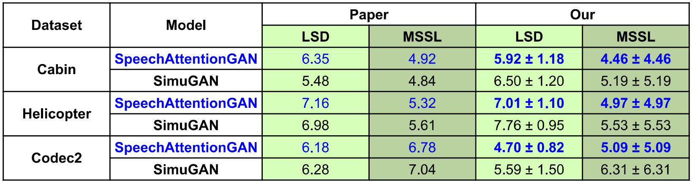

# Simulate Noisy Speech from Clean

## References

This repository is a collection of three other repositories with some adjustments:

- [drowe67/codec2](https://github.com/drowe67/codec2): Used to simulate codec distortion dataset.
- [hsinyilin19/Discriminator-Constrained-Optimal-Transport-Network](https://github.com/hsinyilin19/Discriminator-Constrained-Optimal-Transport-Network): Used to replicate noise to TIMIT dataset.
- [leandermaben/GANSpeechAugment](https://github.com/leandermaben/GANSpeechAugment/): Used for experiments with four GAN models: `SpeechAttentionGAN`, `SimuGAN`, `MaskCycleGAN-Augment`, `Speech2Speech-Augment`.

## Steps to run

### Prepare the dataset

If we want to reuse the data preprocessing code from [DOTN](https://github.com/hsinyilin19/Discriminator-Constrained-Optimal-Transport-Network), we need to format the data in the same way as the TIMIT dataset (which can be done easily using `bash` or `python`). Another note is that our prepared data needs to have the same sample rate as the desired training data or configuration (which can be done by resampling using `torchaudio` or `librosa`).

In the directory `Discriminator-Constrained-Optimal-Transport-Network\Data_preprocessing\preprocessing_TIMIT`, there are two bash scripts used to create data for the following two cases:

1. When we already have `clean` and `noisy` data (for example, when creating codec distortion data using `codec2`, the script `codec2\build_linux\gen_bitrate_wav.sh` is used). Use the bash file `create_codec_timit_format_8000.sh` to create clean data and move the corresponding noisy data to the same location, as well as resample them to the desired sample rate.
2. When we only have `clean` data and some noisy audio files, such as the helicopter audio at `Discriminator-Constrained-Optimal-Transport-Network\Data_preprocessing\preprocessing_TIMIT\noise_types\nonstationary\helicopter.wav` or the cabin audio at `Discriminator-Constrained-Optimal-Transport-Network\Data_preprocessing\preprocessing_TIMIT\noise_types\stationary\cabin.wav`. We will use these files to add noise and simulate noisy data from clean speech data (in the same format as TIMIT) with different SNR ratios (customizable in the file `Discriminator-Constrained-Optimal-Transport-Network\Data_preprocessing\preprocessing_TIMIT\step2_add_noise.py`).

Please refer to the two files `create_codec_timit_format_8000.sh` and `create_timit_8000.sh` for more information.

After preparing the data, we will have directories containing the desired data in the format required by the [leandermaben/GANSpeechAugment](https://github.com/leandermaben/GANSpeechAugment/) repository, which can be used for training. The advantage of non-parallel dataset GAN models is that they require very little data but still generate good data, typically around 3 minutes of data.

### Run the experiments

Two models currently have scripts for experimentation: `SpeechAttentionGAN` and `SimuGAN`, which are reported to have the best results in the paper.

The scripts for experimentation are:

- `SpeechAttentionGAN`: `GANSpeechAugment\SpeechAttentionGAN\experiment_speech_attention_gan.sh`.
- `SimuGAN`: `GANSpeechAugment\SimuGAN\experiment_simu_gan.sh`.

These files contain scripts for data creation, model training, testing, and calculating metrics (LSD and MSSL).

## Replicate results

The same configuration as the repository was used, with only the batch size changed for faster training, and both models were trained for 300 epochs.

## Acknowledgement

This work was done under [I2R, A*Star](https://www.a-star.edu.sg/i2r)